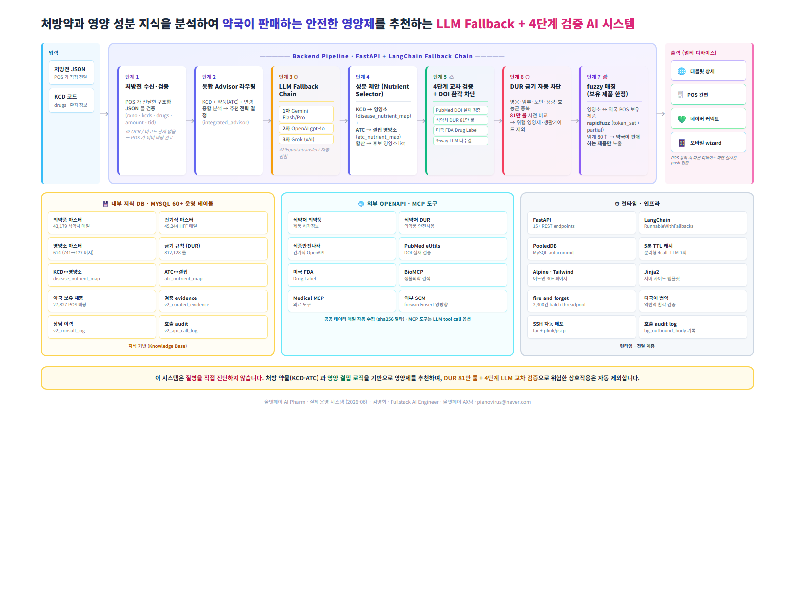
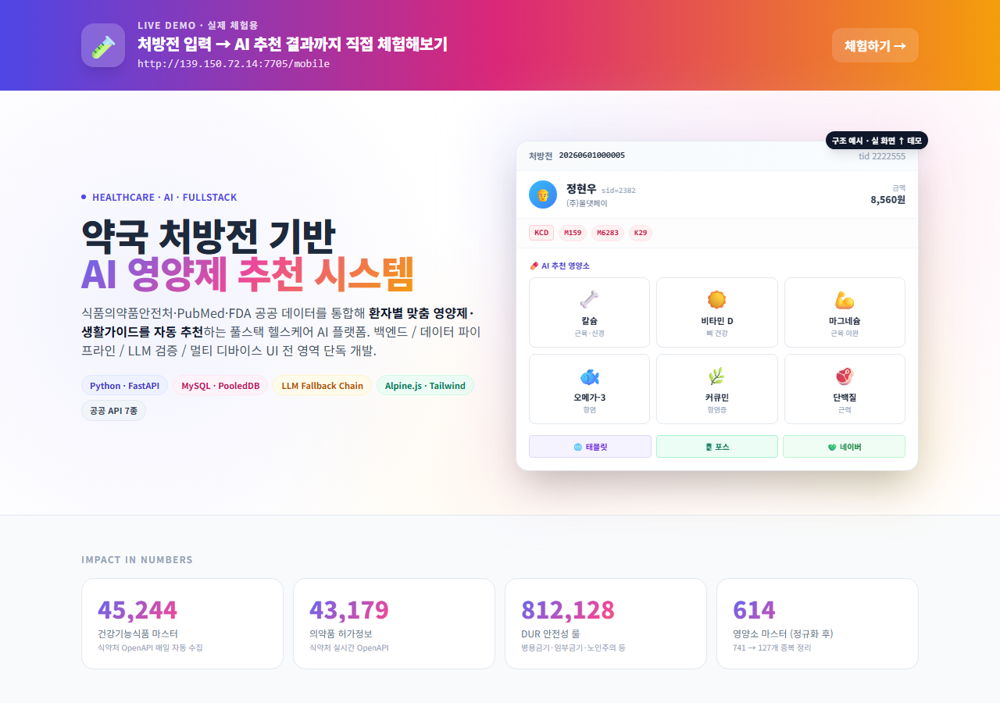
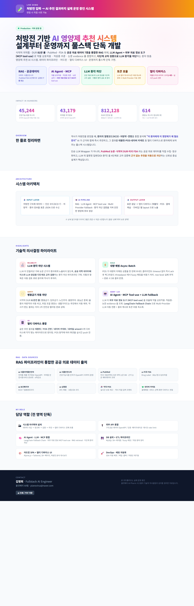

# 🧪 AIPharm 포트폴리오

### 약국 처방전 기반 AI 영양제 추천 시스템

**올댓페이 AI Pharm** — 식품의약품안전처 · PubMed · FDA 공공 의료 데이터를 통합해
**환자별 맞춤 영양제·생활가이드를 자동 추천**하는 풀스택 헬스케어 AI 플랫폼

---

## 🏗 시스템 아키텍처 한눈에 보기

> **처방약 + 영양 성분 지식 → 약국이 판매하는 안전한 영양제 추천 · LLM Fallback + 4단계 교차 검증**

📥 [고해상도 PDF 다운로드](https://github.com/pianovirus/portfolio/raw/main/aipharm-portfolio/system_architecture.pdf) · 🖼 [PNG 원본](https://github.com/pianovirus/portfolio/raw/main/aipharm-portfolio/system_architecture.png)

---

---

## 🧪 Live Demo · 실제 체험용

### 처방전 입력 → AI 추천 결과까지 직접 체험해보기

# [▶ http://139.150.72.14:7705/mobile](http://139.150.72.14:7705/mobile)

---

## 📊 Impact in Numbers

| 데이터 자산 | 규모 | 출처 |
|:---|---:|:---|
| 🍃 **건강기능식품 마스터** | **45,244** | 식약처 OpenAPI 매일 자동 수집 |
| 💊 **의약품 허가정보** | **43,179** | 식약처 실시간 OpenAPI |
| 🛡 **DUR 안전성 룰** | **812,128** | 병용금기·임부금기·노인주의 등 |
| 🧬 **영양소 마스터 (정규화 후)** | **614** | 741 → 127개 중복 자동 정리 |

---

## 📌 Overview

약사가 처방전을 받았을 때, **환자의 질병코드(KCD)·처방약·연령**을 종합 분석해
**"이 환자에게 이 영양제가 왜 필요한지"** AI 가 근거와 함께 즉시 추천하고,
그 결과를 **태블릿 · POS · 네이버 커넥트** 등 멀티 디바이스로 환자에게 보여주는 풀스택 시스템.

단순 LLM Wrapper 가 아니라, **PubMed 논문 · 식약처 DUR · 미국 FDA** 라는 공공 의료 데이터를 직접 수집·정규화하고,
LLM 의 잘못된 답변(DOI 환각) 을 4단계로 교차 검증해 **근거 없는 추천을 자동으로 차단**하는 신뢰성 중심 설계가 핵심.

---

## 🏗 시스템 아키텍처

<table>
<tr>
<td width="33%" valign="top">

### 🟢 LAYER 1
**데이터 수집·정규화**

- 식약처 의약품 허가 OpenAPI (43k건/일)
- 식품안전나라 건기식 OpenAPI (45k건/일)
- 식약처 DUR (병용·임부·노인 81만 룰)
- PubMed 의학논문 검색
- 미국 FDA Drug Label
- 자동 fuzzy 매칭 (영양소 ↔ 제품)

</td>
<td width="33%" valign="top">

### 🔵 LAYER 2
**AI 추천 & 검증**

- 통합 advisor: KCD·ATC 라우팅
- **LLM Fallback** (Gemini → OpenAI → Grok)
- **MCP 도구 호출** (BioMCP · Medical MCP)
- **4단계 검증**: PubMed·KFDA·FDA·LLM
- DOI 환각 차단 (논문 3-way verify)
- 병용금기 자동 차단 (81만 룰)
- 5분 TTL 결과 캐시

</td>
<td width="33%" valign="top">

### 🟣 LAYER 3
**API & 멀티 디바이스 UI**

- FastAPI REST endpoints (15+)
- **fire-and-forget** background task (2,300건 batch)
- 어드민 SPA (Alpine.js + Tailwind)
- 태블릿 / POS 간편 / 네이버 커넥트
- 외부 SCM 양방향 통신
- 처방전 호출 이력 추적

</td>
</tr>
</table>

---

## ⚙ 기술적 의사결정 하이라이트

### 🔬 DOI 환각 4단계 검증
LLM 이 만들어낸 가짜 논문 DOI 가 환자에게 노출되지 않도록,
**PubMed 검색 → 논문 본문 fetch → 3-way LLM 교차 평가 → 다수결 통과만 노출**의 검증 파이프라인 구축.

### ⚡ 2,300건 fire-and-forget Batch
POS 가 미매핑 상품 2,300+건을 한 번에 보내도 클라이언트 timeout 없이 즉시 ack 후
백그라운드 threadpool 에서 fuzzy 매칭·외부 SCM forward 처리.
**500건씩 batch wrap** + row-level 실패 추적.

### 🛡 병용금기 자동 차단
식약처 DUR **81만건 룰**을 환자 처방약과 자동 비교, 위험 조합 영양소·생활가이드는 추천에서 자동 제외.

### 🔁 LLM Fallback Chain + MCP
Gemini 429(quota) → OpenAI → Grok 순으로 자동 전환.
**BioMCP · Medical MCP** 서버 도구 호출로 외부 의료 데이터 직접 조회.
5분 TTL 결과 캐시로 분리형 endpoint 가 같은 처방을 4번 호출해도 **LLM 1회만 호출**.

### 📱 멀티 디바이스 통합
같은 추천 결과를 **태블릿 / POS 간편 / 네이버 커넥트 / 모바일 wizard** 4개 디바이스에
각각 맞는 레이아웃으로 렌더링 + POS 동작 시 실시간 화면 push 전환.

---

## 🗂 통합한 공공 의료 데이터 출처

| 출처 | 활용 |
|:---|:---|
| 🇰🇷 **식품의약품안전처** | 의약품 제품 허가정보 OpenAPI · DUR · e약은요 |
| 🇰🇷 **식품안전나라** | 건강기능식품 인허가 OpenAPI |
| 🇺🇸 **PubMed** | 미국 국립의학도서관 의학 논문 DB · DOI 검증 |
| 🇺🇸 **미국 FDA** | Drug Label · 효능 / 경고 / 상호작용 |
| 🇰🇷 **보건복지부** | KCD-7 질병분류코드 |
| 🇰🇷 **심평원** | ATC 매핑 · 보험 EDI 코드 |
| 🏪 **약국 POS** | 실시간 보유 재고 · 약사 직접 입력 코멘트 |
| 💚 **네이버 커넥트** | 결제예정·서비스 선택 화면 디바이스 연동 |

---

## 👤 담당 역할 (전 영역 단독)

| 영역 | 내용 |
|:---|:---|
| 🏗 시스템 아키텍처 | 데이터 수집 → 정규화 → 검증 → 추천 → 멀티 디바이스 전체 흐름 |
| 🔌 외부 API 통합 | 7개 공공 데이터 OpenAPI / 인증·페이지네이션·재시도·rate limit |
| 🧠 LLM · 검증 시스템 | Multi-provider fallback, 4단계 환각 차단, MCP 도구 호출 |
| 💾 DB 설계 + ETL | MySQL 60+ 운영 테이블 / fuzzy 매칭 / 자동 중복 정리 |
| 🎨 어드민 SPA + 멀티 UI | Alpine.js + Tailwind, 30+ 페이지 |
| 🚀 DevOps · 배포 | SSH 자동 배포 / 백업·롤백 / 무중단 재기동 |

---

## 🛠 기술 스택

`Python` · `FastAPI` · `MySQL` · `PooledDB` · `Jinja2`
`Alpine.js` · `Tailwind CSS`
`LLM Fallback Chain` (Gemini · OpenAI · Grok) · `MCP` (BioMCP · Medical MCP)
`공공 OpenAPI 통합` (PubMed · FDA · KFDA · 식품안전나라 · 보건복지부 · 심평원)

---

## 📑 자세히 보기

- 🌐 [HTML 버전 다운로드](https://github.com/pianovirus/portfolio/raw/main/aipharm-portfolio/portfolio.html)
- 📄 [PDF 버전 다운로드](https://github.com/pianovirus/portfolio/raw/main/aipharm-portfolio/portfolio.pdf)

📸 전체 페이지 미리보기 (펼치기)

---

## 📮 Contact

**김명희** · Fullstack AI Engineer
올댓페이 AX팀

📧 [pianovirus@naver.com](mailto:pianovirus@naver.com)

> 본 포트폴리오는 실제 운영 중인 **올댓페이 AI Pharm** 시스템의
> 기술적 의사결정과 성과를 정리한 자료입니다.

