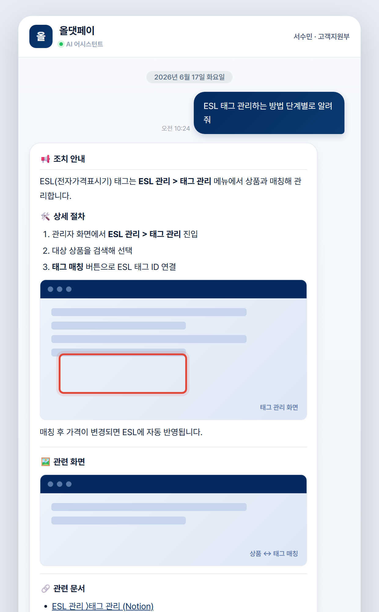
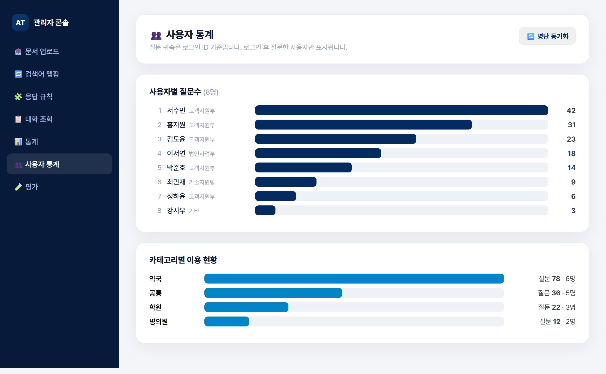
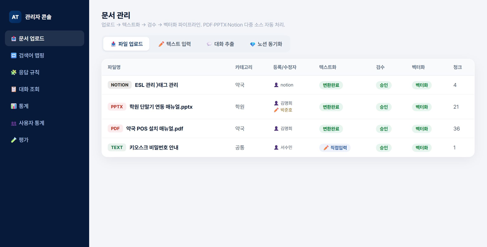

# 🤖 챗봇 포트폴리오

### 사내 지식 기반 RAG AI 어시스턴트

PostgreSQL · pgvector 하이브리드 검색 + Cross-encoder 리랭킹 · 멀티모달 문서 처리(PDF · PPTX · Notion) 
**검색·생성 파이프라인부터 관리자 콘솔 · 사용자 분석 · 배포까지 풀스택 단독 개발**

 

📄 **[PDF 포트폴리오](portfolio.pdf)**  ·  🌐 **[HTML 버전](portfolio.html)**

 

---

## 🖥️ 화면

### 💬 사용자 챗봇 — 근거 기반 답변 + 본문 인라인 화면

질문 유형에 맞춘 구조화 답변 · 절차 단계 옆 관련 화면 인라인 · 출처(Notion·PDF) 링크 · SSE 실시간 스트리밍

  

### 📊 관리자 콘솔 — 사용자 통계

외부 인사 DB 명단 동기화 + 로그인 ID 질문 귀속 → 사용자별 질문수 · 카테고리별 이용 시각화

  

### 🗂️ 관리자 콘솔 — 문서 파이프라인

PDF · PPTX · Notion 다중 소스를 업로드 → 텍스트화 → 검수 → 벡터화로 자동 처리 · 등록자/최종수정자 추적

 

---

## 📌 개요

사내 직원이 업종별 매뉴얼·운영 지식을 **자연어로 질문**하면, 근거 문서를 검색해 **출처와 함께** 답변하는 사내 전용 AI 어시스턴트입니다. *"그럴듯하지만 틀린 답변"* 을 막기 위해 **근거 기반 응답 · 관련 문서 노출 · 미답변 추적**을 핵심 원칙으로 설계했고, 운영을 위한 관리자 콘솔과 사용자 분석까지 하나의 시스템으로 구축했습니다.

|  | 내용 |
|---|---|
| **역할** | 기획 · 아키텍처 · 백엔드 · 프론트엔드 · DB · 배포까지 **단독 풀스택 개발** |
| **문제** | 분산된 업종별 매뉴얼(PDF·PPT·Notion)을 직원이 빠르게 찾기 어려움 · 일반 LLM은 사내 사실을 모르고 환각 위험 |
| **해결** | 사내 문서를 벡터화한 하이브리드 RAG + 리랭킹으로 근거 기반 답변 · 출처 링크와 관련 화면을 함께 제공 |
| **범위** | 약국 · 병의원 · 학원 · 한의원 · 공통 — **5개 업종** |

---

## ⚙️ 핵심 기능

- **🔍 하이브리드 검색 + 리랭킹** — pgvector 임베딩 · 키워드(tsvector) · 구문 매칭을 결합하고 bge-reranker Cross-encoder로 재정렬
- **🧠 LangGraph 대화 파이프라인** — 질문 분류 → 멀티턴 맥락 질의 재작성("그거/아까" 해소) → 검색 → 근거 기반 프롬프트
- **🖼️ 멀티모달 처리** — 이미지 PDF를 Vision LLM으로 읽어 설명+화면 첨부 · PPTX · Notion 연동 · 답변 **본문 사이사이 인라인 이미지**
- **🔄 지식 소스 자동 동기화** — Notion DB를 `last_edited_time` 기반 **증분 동기화**, 만료 이미지 URL은 자체 서버로 재호스팅
- **🛠️ 운영형 관리자 콘솔** — 문서 벡터화 · 미답변/수정요청 · 응답 규칙 · 검색어 매핑 · LLM-as-Judge 평가
- **📊 부서별 사용자 분석** — 외부 인사 DB(MySQL) 명단 읽기전용 동기화 · 로그인 ID 질문 귀속
- **🗄️ POS 데이터 Tool Calling** — 자연어 질의 → 함수 호출(SELECT 전용·실행시간 제한 가드)
- **🔐 사내 계정 인증** — 레거시 인증 API(AES128-CBC) 동등 구현 · 5시간 슬라이딩 세션 · 슈퍼관리자 권한 게이팅

---

## 🚀 기술 하이라이트

<table>
<tr><td width="33%" valign="top">

**① 리랭커 응답속도 최적화**

긴 비전 설명이 Cross-encoder 입력으로 들어가 검색이 수십 초 지연. 후보·리랭커는 유지하고 **입력 텍스트만 절단**, 평가로 품질 검증.

→ **약 3배 가속, 품질 동등**

</td><td width="33%" valign="top">

**② 링크 + 이미지 동시·인라인**

벡터당 출처 1개라 이미지/링크 양자택일이던 문제를, 메타데이터 재호스팅 이미지 + `[그림N]` 토큰으로 **본문 단계 옆 인라인 렌더**.

→ **단계별 화면이 설명 옆에**

</td><td width="33%" valign="top">

**③ 만료 자산 · 미사용자**

만료되는 Notion 이미지를 **재호스팅**, 인사 DB 명단을 **읽기전용 복제**해 로그인 안 한 직원까지 분모 확보.

→ **항상 뜨는 이미지 + 신뢰할 통계**

</td></tr>
</table>

---

## 🧱 기술 스택

| 분류 | 스택 |
|---|---|
| **AI / RAG** | LangGraph · LangChain · pgvector(HNSW) · Cross-encoder 리랭커 · multilingual-e5 · gpt-4o-mini(생성·Vision) |
| **Backend** | Python(http.server, SSE) · PostgreSQL 하이브리드 검색 · PyMuPDF · python-pptx · Tool Calling · AES128 인증 |
| **Frontend** | Vanilla JS SPA(관리자) · 스트리밍 챗 UI · 마크다운·인라인 이미지 렌더 · CSS 데이터 시각화 |
| **Data / Infra** | PostgreSQL · MySQL · Notion API · Linux · systemd · 증분 동기화 · 백그라운드 잡 |

 화면 이미지는 실제 UI를 동일 스타일로 재현했으며 표시 데이터는 예시입니다.

